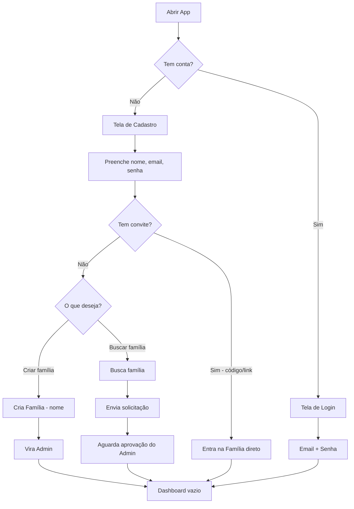
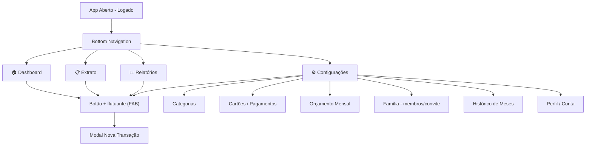
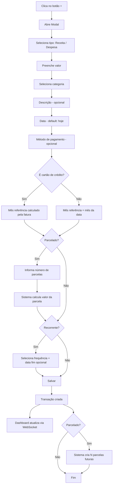
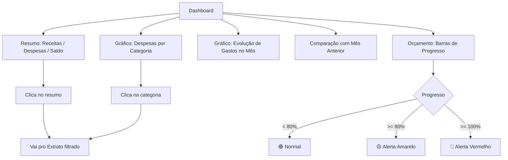
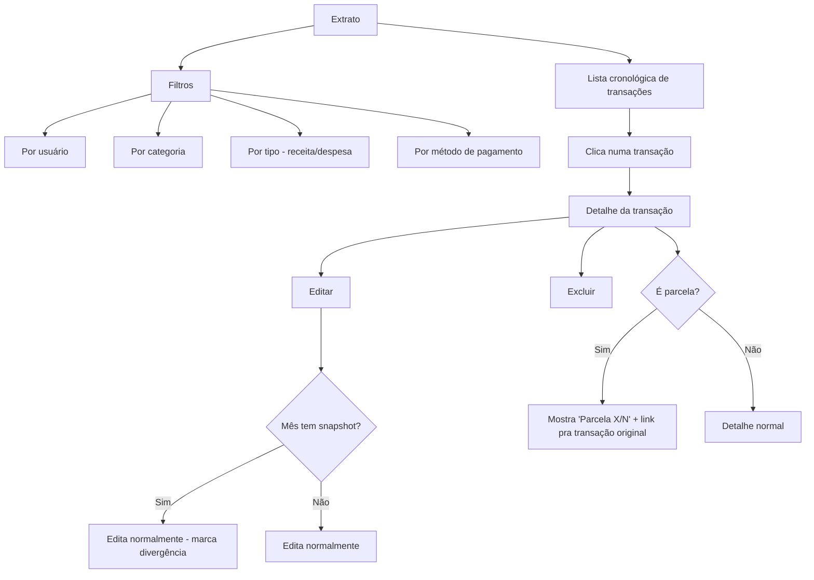
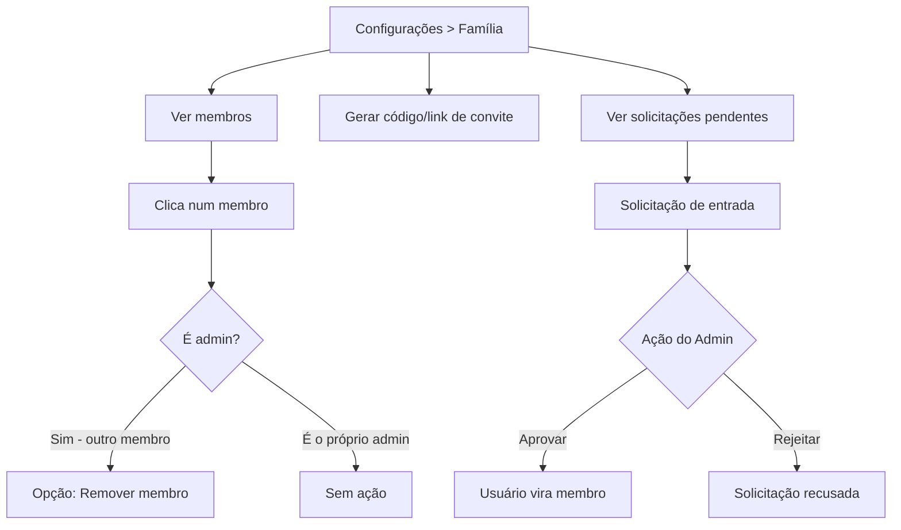
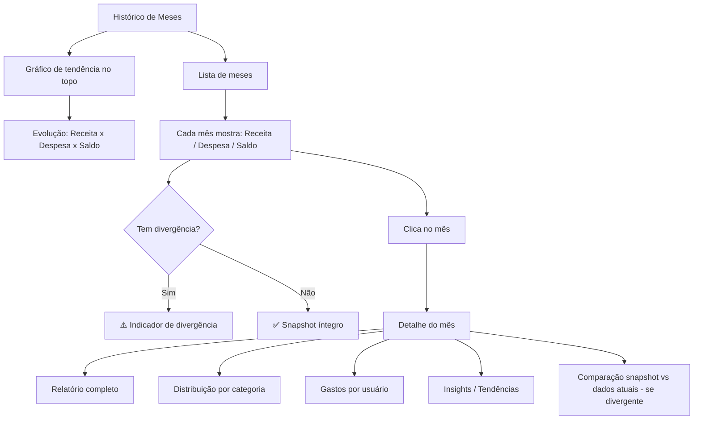

# NossaGrana — Fluxos da Aplicação

---

## Fluxo 1 — Primeiro Acesso / Onboarding

---

## Fluxo 2 — Navegação Principal (Tabs/Menu)

---

## Fluxo 3 — Nova Transação (Modal)

---

## Fluxo 4 — Dashboard do Mês

---

## Fluxo 5 — Extrato do Mês

---

## Fluxo 6 — Gestão de Família (Admin)

---

## Fluxo 7 — Histórico de Meses

